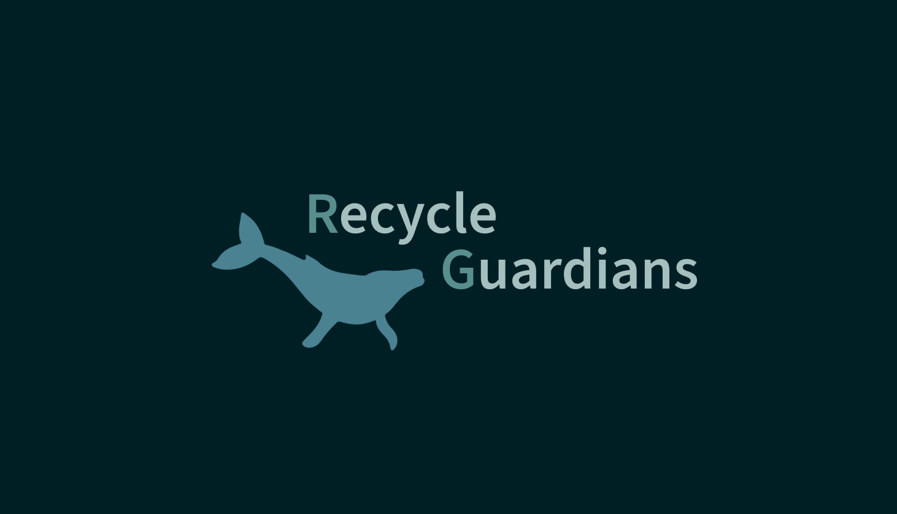

# Recycle Guardians

## Plataforma de Reciclagem Sustentável
 Alysson Alves Pinheiro |  2TDSA|  552410  
 Ana Júlia Almeida         |  2TDSS|  98974   
 Anna Beatriz Soares     |  2TDSA|  99814   
 Cauã Couto                    |  2TDSS|  97755   
 Nicoly Oliveira                 |  2TDSS|  552410  
------------------------------------------------------

 
## Visão Geral

A Plataforma de Reciclagem Sustentável é uma solução inovadora que visa incentivar e recompensar a reciclagem de resíduos plásticos, especialmente aqueles com alto potencial de poluição marinha. Ao integrar tecnologias como Inteligência Artificial, um aplicativo móvel e parcerias com empresas e comunidades, a plataforma cria um ciclo virtuoso de reciclagem, que não só contribui para a preservação do meio ambiente, mas também engaja e recompensa os usuários por práticas sustentáveis.

## Funcionalidades Principais

### 1. Cadastro e Perfil do Usuário

- **Registro de Usuário:** Os usuários podem se cadastrar na plataforma fornecendo informações básicas, como nome, endereço de e-mail e localização.
- **Perfil Personalizado:** Cada usuário tem um perfil onde pode acompanhar suas atividades de reciclagem, pontos acumulados e histórico de trocas de brindes.

### 2. Classificação e Avaliação dos Resíduos com IA

- **Registro Manual dos Resíduos:** Os usuários podem registrar manualmente os resíduos plásticos, fornecendo detalhes como tipo de plástico, quantidade e, se possível, o código de reciclagem presente no produto.
- **Classificação de Risco com IA:** A IA analisa os dados fornecidos e classifica o nível de risco do plástico para o ambiente marinho, com base em diversas características como tipo de plástico, uso e potencial de degradação.
- **Nível de Risco:** A IA determina o nível de risco do plástico para o ambiente marinho (baixo, médio, alto) com base nas características mencionadas.

### 3. Pontuação e Recompensas

- **Atribuição de Pontos:** Com base na classificação da IA, os usuários recebem uma quantidade de pontos proporcional ao nível de risco dos resíduos reciclados.
- **Sistema de Recompensas:** Os pontos acumulados podem ser trocados por brindes, como produtos sustentáveis, descontos em lojas parceiras ou doações para projetos ambientais.

### 4. Validação da Reciclagem

- **Entrega em Pontos de Coleta:** Os usuários devem levar os resíduos até pontos de coleta parceiros.
- **Verificação por QR Code:** Cada ponto de coleta tem um QR code exclusivo. O usuário escaneia o QR code ao entregar os resíduos para confirmar a entrega.
- **Validação Final:** A plataforma verifica a entrega e credita os pontos na conta do usuário.

### 5. Integração com Comunidades e Parcerias

- **Parcerias com Empresas:** Colaboração com empresas que oferecem brindes e recompensas, além de apoiar a iniciativa de reciclagem.
- **Comunidades de Reciclagem:** Criação de comunidades dentro da plataforma para promover a troca de informações e incentivo mútuo entre os usuários.

### 6. Monitoramento e Relatórios

- **Dashboard de Dados:** Oferece um painel para monitorar a quantidade de resíduos reciclados, impacto ambiental reduzido e pontos distribuídos.
- **Relatórios Personalizados:** Os usuários podem acessar relatórios sobre suas contribuições individuais para a reciclagem e o impacto ambiental.

## Tecnologias Utilizadas

- **Inteligência Artificial:** Algoritmos de aprendizado de máquina para análise e classificação de resíduos.
- **Aplicativo Mobile:** Disponível para Android e iOS, onde os usuários podem registrar resíduos, acompanhar pontos e trocar brindes.
- **Infraestrutura de Backend:** Servidores e bancos de dados para armazenar informações dos usuários, histórico de reciclagem e pontos.
- **Segurança e Privacidade:** Garantia da segurança dos dados dos usuários e conformidade com regulamentos de proteção de dados.

---------------------------------------------------------------------------------------------------
## Links IMPORTANTES 

- [Documentação](https://www.canva.com/design/DAGHZBbKYr4/s5w8HT3w0uvJsl1o7kQnGg/edit?utm_content=DAGHZBbKYr4&utm_campaign=designshare&utm_medium=link2&utm_source=sharebutton)
  
- [Figma](https://www.figma.com/design/aUtkmnBXpjEWZkqXVUkNNX/Global?node-id=0-1&t=sBARk7lewqdqSPN6-1)
 
- [Vídeo Pitch](https://youtu.be/EK7IvoCNhmI?si=svhxPc7uV_Z0gRbl)


-----------------------------------------------------------------------------------------------------

## Requisitos

Antes de iniciar, certifique-se de ter instalado o seguinte:

- Node.js (https://nodejs.org/)

# Como Executar o Projeto

1. **Clone o Repositório**:

```bash
git clone https://github.com/AnnaBsoares/App_RecycleGuardians.git
```
2.Instale as Dependências:
```
cd 2024-2tdsa-o20-global-solution-recycle-guardians
npm install
```
3.Execute o Projeto:
```
npx expo start
```
4.Acesse o Aplicativo:

Escaneie o QR code gerado com o aplicativo Expo Go em seu dispositivo móvel, ou
Abra o simulador iOS ou Android, dependendo da sua preferência, ou
Acesse via web.


7.Contribuição

Contribuições são bem-vindas! Sinta-se à vontade para enviar pull requests com melhorias, correções de bugs ou novas funcionalidades.

---------------------------------------------
Licença

Obrigada pela atenção!

Anna.
Recycle Guardians.
